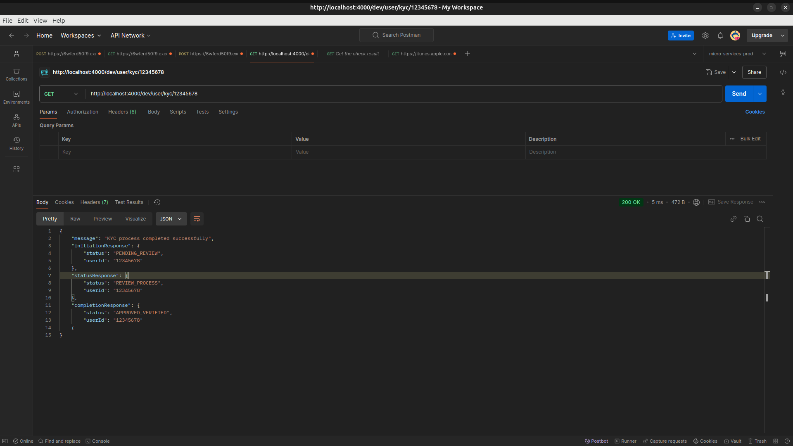

# KYC Micro-Services

This project contains a monorepo setup for KYC-related microservices using Nx and Serverless Framework. The repository is structured to help you easily manage and deploy multiple services and an SDK within a single workspace.

## Table of Contents

- [KYC Micro-Services](#kyc-micro-services)
  - [Table of Contents](#table-of-contents)
  - [Project Structure](#project-structure)
  - [Getting Started](#getting-started)
    - [Prerequisites](#prerequisites)
    - [Install Dependencies](#install-dependencies)
  - [Common Commands](#common-commands)
    - [Build All Services](#build-all-services)
    - [Run All Services Locally](#run-all-services-locally)
    - [Deploy All Services](#deploy-all-services)
    - [Clean the Project](#clean-the-project)
    - [Testing](#testing)
    - [Formatting and Linting](#formatting-and-linting)
    - [Dependency Graph](#dependency-graph)
    - [Affected Commands](#affected-commands)
  - [Working with the SDK](#working-with-the-sdk)
  - [Nx Cloud](#nx-cloud)
  - [Summary of Estimated Monthly Costs](#summary-of-estimated-monthly-costs)
    - [Service Configuration and Estimated Monthly Cost](#service-configuration-and-estimated-monthly-cost)
    - [Recommendations](#recommendations)

## Project Structure

```bash
kyc-micro-services/
├── services/
│   ├── kyc-service/ # KYC service for handling KYC operations
│   ├── user-service/ # User service for managing users
│   └── kyc-sdk/ # SDK to interact with KYC service
├── config/ # Common configuration files
├── node_modules/ # Project dependencies
├── dist/ # Compiled output directory
├── package.json # Project configuration and scripts
└── README.md # Project documentation
```

## Getting Started

### Prerequisites

- **Node.js**: Install the latest LTS version.
- **Yarn**: Install Yarn globally for managing dependencies.

```bash
 npm install -g yarn
```

- **Nx**: Install Nx globally.

```bash
  yarn global add nx
```

- **Serverless Framework**: Install Serverless CLI.

```bash
  yarn global add serverless
```

- **AWS Credentials**: Ensure AWS credentials are configured on your system.

### Install Dependencies

Clone the repository:

```bash
git clone https://github.com/your-username/kyc-micro-services.git
cd kyc-micro-services
```

Install all dependencies:

```bash
yarn install
```

Set up environment variables for each service (e.g., `services/kyc-service/.env`).

## Common Commands

The following commands can be run at the root level to manage all services together.

### Build All Services

To build all services and libraries in the project:

```bash
yarn build
```

### Run All Services Locally

To run all services locally using Serverless Offline:

```bash
yarn dev
```

### Deploy All Services

To deploy all services to AWS:

```bash
yarn deploy
```

### Clean the Project

To remove `node_modules` and build artifacts across all services:

```bash
yarn clean
```

### Testing

To run tests for all services:

```bash
yarn test
```

To check test coverage:

```bash
yarn test:coverage
```

### Formatting and Linting

To format code across all services:

```bash
yarn format
```

To check formatting:

```bash
yarn format:check
```

To run linting for all services:

```bash
yarn lint
```

### Dependency Graph

To visualize the dependency graph for the project:

```bash
yarn dep-graph
```

### Affected Commands

The affected commands are useful when you have made changes to specific services or libraries. Nx will only run tasks on projects affected by the recent changes, making development faster.

Examples:

Build affected services:

```bash
yarn affected:build
```

Run affected services locally:

```bash
yarn affected:dev
```

Deploy affected services:

```bash
yarn affected:deploy
```

## Working with the SDK

If you make changes in `kyc-sdk`, follow these steps:

Rebuild the SDK:

```bash
yarn nx run kyc-sdk:build
```

Run dependent services to test the SDK. For example, if both `kyc-service` and `user-service` depend on `kyc-sdk`, run:

```bash
yarn nx run kyc-service:dev
yarn nx run user-service:dev
```

Use the `dev:no-cache` option if you want to skip caching:

```bash
yarn dev:no-cache
```

## Nx Cloud

Nx Cloud can improve build performance by caching previous runs and distributing tasks across multiple machines. To connect to Nx Cloud:

```bash
yarn nx connect-to-nx-cloud
```

For more information, visit the [Nx Cloud documentation](https://nx.app/).

## Summary of Estimated Monthly Costs

This SDK is designed to handle up to 5,000 API requests per month. Below is an estimated cost breakdown for the various AWS services that could be used to deploy this SDK, with a focus on cost efficiency and scalability.

### Service Configuration and Estimated Monthly Cost

| Service Configuration      | Estimated Monthly Cost |
| -------------------------- | ---------------------- |
| API Gateway + Lambda       | ~$0.33                 |
| API Gateway + Fargate      | ~$0.11                 |
| Amazon DynamoDB (optional) | <$0.01                 |
| Amazon EC2 (t4g.micro)     | ~$7.48                 |

### Recommendations

- **API Gateway + Lambda**: Ideal for low to medium traffic, serverless, and highly scalable, with minimal management required.
- **API Gateway + Fargate**: Best for cases requiring containerization with a serverless billing model, keeping costs low for intermittent usage.
- **DynamoDB**: Optional for storing KYC records, adding negligible cost for the estimated usage.
- **EC2**: Suitable for more customizable, always-on deployments but generally more costly for low traffic volumes.

These estimates provide a cost-effective approach to hosting the SDK, with serverless options being the most economical and scalable. Adjustments may be needed based on usage patterns and additional requirements.


